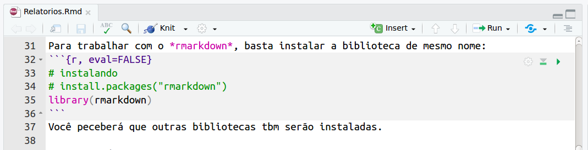
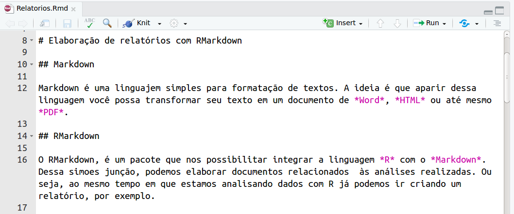
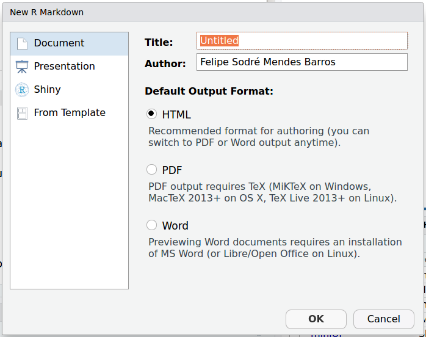
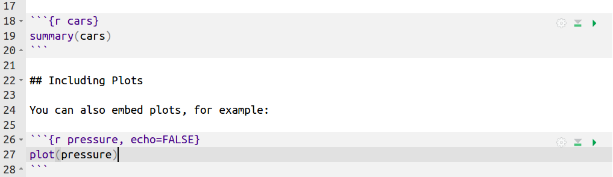
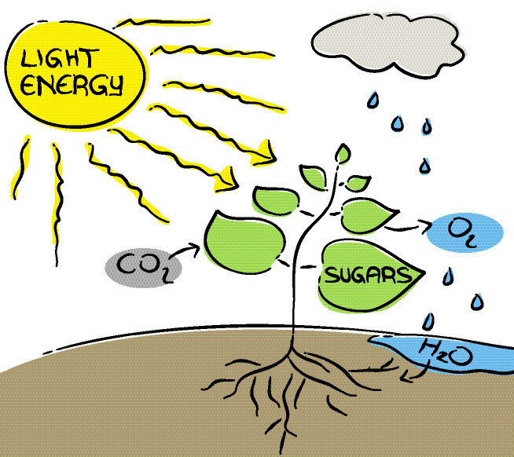

# Elaboração de relatórios com RMarkdown  

## Markdown  {#markdown}

Markdown é uma linguajem simples para formatação de textos. A ideia é que aparir dessa linguagem você possa transformar seu texto em um documento de *Word*, *HTML* ou até mesmo *PDF*.

## RMarkdown  {#rmarkdown}

O RMarkdown, é um pacote que nos possibilitar integrar a linguagem *R* com o *Markdown*. Dessa simoes junção, podemos elaborar documentos relacionados  às análises realizadas. Ou seja, ao mesmo tempo em que estamos analisando dados com R já podemos ir criando um relatório, por exemplo.  

Com o *RMarkdown*, pode-se também elaborar outros tipos de documentos, como apresentações. Vamos ver primeiro como elaborar documentos de texto e, mais à frente, vemos como trabalhar com apresentações.  

Para mais informações sobre o [RMarkdown, clique aqui](http://rmarkdown.rstudio.com).


### Vantagens

Usar o RMardown traz várias vangens, das quais cito:
- Fomenta a reproducibilidade;  
- Permite que mais de uma pessoa possa colaborar com o relatórios (usando *Git* e *GitHub*);  
- Permite apresentar o código usado, caso isso seja importante;  
- Facilita a criação e incorporaçãod e gráficos/tabelas e dados do projeto ao relatório  

### Instalação

Para trabalhar com o *rmarkdown*, basta instalar a biblioteca de mesmo nome:  
```{r, eval=FALSE}
# instalando
# install.packages("rmarkdown")
library(rmarkdown)
```
Você peceberá que outras bibliotecas tbm serão instaladas.  

### Antes de começar

Alguns pontos básicos:  
  
- A extensão usada é a *.Rmd* (*markdown* ocupa solo .md), independente do tipo de documento que se pretende criar (*HTML*, *PDF* ou *Doc*);  
- Ao criar um documento *Rmd* novo, o mesmo terá, sempre, um exemplo (conteúdo) basico explicandoc omo usar;  
- Em todo documento *Rmd* poderá ter três elementos:
  - Cabeçalho de configuração (começa e termina com  - - - ) ( \autoref{configRmd} );  

{ width=50%}  

  - Pedaços de código (*code chunk*) (começa e terminam com   ' ' ' ) ( \autoref{codigor} );  

{ width=50%}  

- O texto em sí, usando a linguajem *Markdown* para definição de título, negrito, etc ( \autoref{txtrmd} );  

{ width=50% }  

Uma vez criado o documento com o texto e as análses feitas, o mesmo será **renderizado**  e transformado em um documento no formato solicitado.  

## Criação do documento  {#CriacaoDoc}  

Ao criar um novo documento *Rmd*, você poderá escolhar entre *HTML*, *PDF* ou *Word* ( \autoref{NewDoc} ). Escolha o que for de sua preferencia e não se preocupe pois é possível mudar o tipo de documento, sempre que se fizer pertinente (também veremos isso mais à frente na seção \ref{ExI} ).  

{ width=50% }  

Cada trecho de código, sempre que estiverem dentro da área delimitada para codigo r ( \autoref{codigor} ),  pode ser executado para se ter conhecimento de seu resultado. O resultado apresentado fará parte do documento final, uma vez que o mesmo seja **renderizado**.  

A qualquer momento você pode **renderizar** o documento o transofmrado em *HTML*, *PDF* ou *Doc*, usando o botão *Knit*. è nesse menu que podemos mudar o formato final do documento, caso seja necessário.  

### Exercicio I (alterando formato *output*)  {#ExI}
  
1. Criar um *Rmarkdown* e executar-lo sem modificar nada;  
1. Executa-lo novamente, mas dessa vez alterando o formato final pelo menu do *Knit* ( \autoref{KnitMenu} );  

{ width=50% }  

## Sintaxe Markdown  {#SintaxeMarkdown}

Como mencionado anteriormente, ao usar um arquivo *\*.Rmd* temos a possibilidade de mesclar a linguagem de formatação de texto *Markdown* com códigos R. Vamos começar entendendo a sintaxe *Markdown*.  

A sintaxe *Markdown* é toda relacionada à **formatação de texto**. Como vocês puderam observar ao *renderizar* o documento padrão (exercício anterior), o símbolo \#\# define que naquela linha estará o texto com um título de segunda ordem no nível hierarquico, já que o título de primeira ordem seria definido com apenas um \#. A hierarquia de títulos é, portanto, definida pela sequência de \#. Por exemplo, na figura \autoref{txtrmd}:  
  
* O texto "Elaboração de relatórios com RMarkdown" será o título do documento, por possuir apenas um \#.
* Logo em seguida, será incluído um título de segunda hierarquia (subtítulo ?) com texto "Markdown" (já que o mesmo é precedido por dois \#).  
* A sequencia segue até satisfazer o nível hierarquico de títulos do seu documento;  

Uma coisa bem legal desse sistema de formatação de texto é que, por ser declarativo por texto (ou comando em sintaxe *Markdown*), fica fácil colaborar com outras pessoas sem perder as configurações, além de deixar claro a estrutura do texto. Claro, isso desde que sempre se edite o arquivo *Rmd.* Caso contrário isso dependerá dos conhecimentos dos usuários de softwares de eedição de texto, como o *MS Word*.  

Outros elementos importantes para formatação de texto são:  
  
* **Negrito**: Para colocar uma palavra ou frase em negrito, basta usar dois asterístico (\*\*)  para iniciar o trecho e dois asterístico para fechar o texto a ser enfatizado (ex.: \*\*trecho em negrito\*\*).  
* *Itálico*: Similar ao **negrito**, mas usa-se apenas um asterístico no início e outro no fim (ex.: \*trecho em italico\*).  
* ~~riscado~~: Basta inserir dois tis (\~\~) ao início e outros dois ao fim do trecho a ser riscado (ex.: \~\~trecho riscado\~\~);  

Pontos importantes:  

Os elementos de formatação de texto, comom **negrito**, *italico*, ~~riscado~~, dentre outros, deverão ser seguidos por texto, sem espaço entre o elemento de formatação e o texto a ser aplicado a formatação. Contudo, já com relação aos títulos, é necessário dar espaço entre o \# e o texto a receber a formatação de titulo.  

### Exercício II (Sintaxe markdown)  
  
1. Colocar todo o primeiro parágrado como riscado;
1. Colcoar algumas paravras em **negrito**;  
1. Colocar outras palavras em *intálico*;  
1. Alterar a hierarquia dos títulos;
1. Cria um novo título de primeira hierarquia;  

## Trabalhando com códigos R  {#TrechoR}

Já vimos como identificar e inserir código *R* em nosso documento de texto. Vimos que existe um padrão para isso. Mas vamos a alguns detalhes ( \autoref{DetalhesR} ):  



Após inserir o padrão que delimita um trecho de código *R* em nosso documento, vemos que entre chaves temos vários elementos... Vamos explorá-los!  

### *labels*  {#RLabels}

Na \autoref{DetalhesR} vemos, logo após a linguagem que estamos trabalhando (*r*, neste caso), um texto: **cars**, no primeiro trecho de código; e **pressure**, no segundo trecho de código. Esse texto é uma *label* que **podemos** criar (**opcional**) para cada trecho de código. Ele serve para facilitar na **compilação** do documento final. Caso algum trecho de código apresente erro, o erro e a *label* serão informados, o que facilitará nossa vida quando estivermos trabalhando com um documento com vários trechos de código diferentes.  

Alguns detalhes com relação a essa *label*:  
  
1. Não podem conter espaço;
1. Se não houver nenhum texto após a informação da linguagem usada, será criada uma label padrão *unnamed-chunk-1*. O número final é sequencial em referencia à sequencias aos quais os trechos de código aparecem sem *label*.  
  
### *configurações do **code chunk** *  

Ainda tendo como referência a \autoref{DetalhesR}, vemos no segundo trecho de código a opção *echo=FALSE* logo após o texto da *label* e separado por vírgula. Se trata de uma das **várias** opções de configuração desse trecho de código.  

Como são muitas opções, vamos trabalhar com apenas quatro delas:
  
1. *echo*: Dever conter valor *TRUE/FALSE* e define se o texto do código inserido deverá constar no texto do documento. Por padrão está definida como *TRUE*, já que se usa muito o *RMarkdown* para fins didáticos, onde se tem interesse de motrar o código usado e o resultado do código.  
1. *eval*: Também definido como *TRUE/FALSE*, define e o trecho de código deverá ser executado. Como padrão está definido como *TRUE*. Pode parecer estranho e existencia/necessidade dessa opao. Afina, porque necessitaríamos um trecho de código se não for para executá-lo? Pense num exemplo: você está criando um documento mostrando como funciona o comando de instalação de bibliotecas ("install.packages(ggplot)", por exemplo). Se você não anterar o *eval* para *FALSE*, sempre que você *renderizar* seu documento ele fará a instalação da biblioteca. É o que queremos? Imagino que não...  
1. *include*: Definido por padrão como *TRUE*, define se o trecho de código, **que será executado** apresentará no texto do documento seus resultados, mensagens e avisos (*warnings*); Também parece sem sentido? Vamos a um exemplo: Queremos, em algum momento salta o determinado aquivo em *.csv*. Mas não precisamos ter isso no exposto em nosso texto final, então podemos usar essa opção e, sem precisar mechar em vários opções já desabilitar qualquer tipo de mensagem relacionado a essa tarefa ao mesmo tempo que grantimos que a mesma seja executada.  
1. *fig.width*: Vimos na \autoref{DetalhesR} que podemos inserir um gráfico direto ao nosso documento sem a necessidade de salva-lo como uma figura e depois insri-lo ao texto. Contudo, como faríamos para ajustar o  tamanho do gráfico? Para isso serve as opções *fig.width* e *fig.heigth*. Essas opções devem ser seguidas de um valor numérico (exemplo, *fig.width = 7*) representando o tamanho de largura/altura da figura em *inches*;  

### Inserir *plot*  {#InserirPlot}

Perceba que o segundo trecho de código do documento padrão é um simples comando ```plot(pressure)```. Isso, por sí só, faz com que o *plot* realizado seja incluido no documento final ao *renderizá-lo*.  

### Exercício (opções de codigo R)  

1. No *Rmd* criando anteriormente, altere os parâmetros dos trechos de código. Quais são os rsultados das alterações realizadas?  
1. Altere o gráfico usando *ggplot*;  
    * Perceba que há que carregar a biblioteca (incluí-lo no trecho de código).  

### *inline code*

Já vimos como inserir trechos de código no no nosso texto. Uma coisa que não vimos é o chamado *inline code*, que é a possibilidade de escrever um codigo curto (de uma linha) e que terá seu resultado inserido na mesma posição e que se encontra o código.

Para usá-lo basta usar uma crase (``` ` ```) seguida pela definição da linguagem de programação a ser usada (meste caso, r) e posteriormente o código necessário. Exemplo: ``` ` r length( c(1, 2, 3, 4)) ` ```

Para que serve? Vamos imaginar que estamos escrevendo um artigo e precisamos dizer a quantidade de dados que usamos. Uma possibilidade (vou chamá-la de tradicional) seria consultar a quantidade de linhas ou o *length* de nossos dados no *R* e escrevê-lo posteriormente no nosso texto. Mas e se nosso dados mudarem? Teremos que fazer isso de novo. Aí é que entra o *inline code*. Com ele bastaria escrever:  

**Exemplo**:  

> Em nossa análise foi realizada a média de ``` ` r length( c(1, 2, 3, 4)) ` ``` valores numérico sorteados ao azar, cujo resultado foi de ``` ` r mean( c(1, 2, 3, 4)) ` ```;  

**Resultado**:  

> Em nossa análise foi realizada a média de `r length( c(1, 2, 3, 4)) ` valores numérico sorteados ao azar, cujo resultado foi de `r mean( c(1, 2, 3, 4)) `;  

## Inserindo tabela

```{r, include = FALSE}
#write.csv(as.data.frame(c(1,2,3,4)), "texte.csv")
```

## Inserindo imagem  {#InserindoImagem}

Já vimos como inserir um gráfico gerado direto de um código *R*. Lembra? Isso foi na seção \ref{InserirPlot}. Mas sabemos bem que nem todas as imagens e figuras de nossos documentos e/ou artigos são provenientes do *R*. Então precisamos saber como inseri-las.  

Para fazer isso basta incluir o seguinte código ``` ```. A exclamação tem que se mantida. E dentro dos colchetes, podemos escrever a legenda da imagem, quando acharmos pertinente. **Veja a seção \ref{MarkdownConfig} para saber o que é preciso ser modificado na configuração do *Markdown* para que a legenda de imagens sejam usadas.** Não se preocupem... é uma linha que muda tudo!

Das maiores fontes de erro ao inserir imagens, antecipamos:  
  
* Caminho para imagem errado[^1];   
* Nome errado do arquivo;  
* Falta de parágrafo antes e depois de onde deverá ir a imagem [^2];

[^1]: Só esse tema vale um capitulo... Mas em resumo, podemos usar um caminha relativo, que considera sempre apartir da pasta de trabalho atual (*Working Directory*); Ou caminho absoluto, que informará todas as pastas desde o diretório "raiz";  
[^2]: Isso faz parte de algumas ocisas inexplicáveis do *Markdown*... As vezes precisamos dar espaço entre parágrafos para que alguns recursos funcionem. As vezes não.  

## Referência cruzada  

Por referência cruzadas entendemos a possibilidade de referir-se a imágens e seções de texto, sem termos que preocuparmo-nos com seus respectivos números, facilitando **em muit** a edição e a manutenção de nossos textos. Isso pelo fato de ambos serem sempre atualizados segundo a ordem das figuras/seções a cada *renderização*.  

### Plot  

Vimos em \ref{InserirPlot} como inserir plot. Mas como usá-lo em referencia cruzada?


```{r PlotTest, fig.cap = "legendaaaaaa"}
plot(c(1,2,3,4), c(1,2,3,4))
```  

imagem de teste \autoref{PlotTest} d

### Imagem  

Bom, vimos na seção \ref{InserindoImagem} como inserir uma imagem. Lembram?  

``` ```  

Vimos ainda que podemos inserir uma legenda a essa figura. Lembra?  

``` ```  

Pois bem, se queremos fazer uma referencia a essa imagem usando a *ferramenta* de referência cruzada, basta entre os colchetes inserir uma *label* a essa mesma imagem (``` \label{LabelDessaImagem}``` ). Assim como as *labels* dos trechos de código (conforme mencionado na seção \autoref{RLabels} ), elas deverão ser como um ID e não poderão se repetir em diferentes imagens:  

``` ```  

O que fizemos até agora foi criar uma *label* para a imagem que queremos referenciar em alguma parte do texto. Agora, para fazer a referencia a essa imagem, basta usar ``` \autoref{LabelDessaImagem} ```.  

**Exemplo**:  

> ```  ```  
> veja a ``` \autoref{LabelDessaImagem} ``` ela é muito legal a responde todas as questões científicas sobre a restauração!  

**Resultado**:  

{ width=50% }  

> veja a \autoref{SolucaoRestauracao} ela é muito legal a responde todas as questões científicas sobre a restauração!  

**E quando a imagem for de um grafico gerado ???**  

### Seção  

Qaundo quisermos fazer referencia a alguma seção, precisaremos criar uma label nessa seção, usando o *comando* ``` {#labelsecao} ```, para depois referenciá-la no texto usando ``` \ref{labelsecao} ```.  
Repare que, para criar a seção, devemos inserir \# antes do texto da *label*. E no comando ```\ref{}``` a label vai sem o \#. Evite usar espaço!  

## Nota de roda-pé

Atualizar para esse sistema!^[```^[]```]  
~~Para inserir nota de roda-pé é muito fácil. Basta inserir após o trecho que deva conter a nota ``` [^1] ```. Com isso vc está criando a "ancorargem" à nota. Ou seja está informando que alí deverá entrar um valor superescrito que estará linkado com a nota de roda-pé. E para criar a nota, basta colocar em qualquer momento do texto ``` [^1] ```: seguindo do texto de nota.~~  

**Exemplo**:  

> Quando lhe disserem que você não consegue, lembre-se que os grandes heróis já ouviram isso e nunca desistiram ``` [^1] ```.  
> ``` [^1]: ``` Frase retirada de: https://www.mundodasmensagens.com/frases-efeito/  

**Resultado**:

> Quando lhe disserem que você não consegue, lembre-se que os grandes heróis já ouviram isso e nunca desistiram [^3].  

[^3]: Frase retirada de: https://www.mundodasmensagens.com/frases-efeito/  

Pontos importantes:  
  
* O valor numérico dentro do colchete não pode ser repetido (ou usado para outra nota diferente);  
* O valor numérico dentro do colchete não precisa representar a ordem de aparição das notas! Isso facilita em muito por não exigir reescrever todos os valores de nota de roda-pé subsequentes a uma nota removida;  

## Referencias bibliográficas  

## Math

## Artigo?

### Configuração Markdown  {#MarkdownConfig}

`number_sections: yes`

```
output:
  pdf_document:
    fig_caption: yes
```

## Mais infos

Markdown é um universo, juntando com as possibilidades de programaçao do R, fica maior ainda. Por isso cobri nesse documento apenas os elementos básicos para compreender como usá-los. Mas para extrair o máximo de todo esse potencial, sugiro que estude por conta própria. Só o [*sheat sheet*](https://www.rstudio.com/wp-content/uploads/2015/02/rmarkdown-cheatsheet.pdf), já é um om começo.