## Do que se trata? (Introdução)

Controle de versão é uma forma de registrar as alterações realizadas (e a evolução) de pedaços de código/scripts/software ao longo do tempo. É comum usarmos algumas estratégias para essa mesma finalidade, como por exemplo:
  
* Nomear o script que desenvolvendo com a data da ultima alteração e o autor responsável:  
**Tese01_06_FB.R**, **Tese02_07_FB.R**, **Tese01_08_Orientador_FB.R**, **Tese_FINAL_FB.R**, **Tese_FINAL_FINALLLLLL_FB.R**.  
  
Porém, há sempre a necessidade de versionarmos um mesmo documento de forma sincronizada com outros colaboradores. Geralmente acreditamos que basta compartilhar os dados/documentos em uma pasta em algum sistema de *núvem* (*oneDrive* *GoogleDrive*, *Dropbox*, etc), além de comentar a tais colaboradores que deverão seguir a regra anterior de nomeação dos scripts.  

Pode ser que tais estratégias sejam úteis e suficiente para alguns trabalhos. Mas há, hoje em dia sistemas mais interessantes para fazer o mesmo de forma robusta e até certo ponto, bem facilitada com a ajuda do **RStudio**.  

Para o controle de versões de scripts, vamos usar o **GUT**; E para podedrmos trabalhar com outros colaboradores, vamos suar o *GitHub* (mas outros sistemas similares podem ser usados, como: *Gitlab*, *Bitbucket*). Vamso falar sobre eles mais para frente.

### Benefícios  

O controle de versão de seus scripts, códigos, funções e etc são importantes quando:  
  
- Vocês perceba que seu código não está produzindo o resultado após alguma modificação e vocês necessite retorná-lo ao um determinado ponto anterior;  
- Você, mesmo que sem querer tenha deletado algum pedaço do seu código e o necessita;  
- Quando você deseja mostrar o que foi feito, ou quer ver o que outro(s) colaborador(es) fez (fizeram);  
- Vocês quiser testar alguma modificação no código sem ter certeza que o que você pretende fazer funcionará;  

### GIT: do que se trata?  

GIT é um sistema de versionamente criado por [Linus Torvald]() para permitir e facilitar a colaboração no desenvolvimento do [Linux]() de forma [assyncrona]();  
A ideia é que os colaboradores de um projeto possam criar modificações, fazer testessem comprometer a versão *estavel* do script/função/software.  
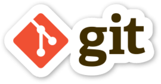
  
## GIT: Instalação e configuração  
  
1. [Download](https://git-scm.com/downloads)
1. Configuração
  - Nome de usuário;  
  - E-mail;  
```{r, eval=FALSE}
git config --global user.name "Mona Lisa"
git config --global user.name

git config --global user.email "email@example.com"
git config --global user.email
```
  

### Configurando RStudio
O GIT é um sistema idenpendente do *RStudio*. Ele pode ser usado através de um terminal, ou até de uma interface gráfica bem básica; Contudo, já é comum que as IDEs (Itegrated Development Environment), como *RStudio*, incorporem funcionalidades do GIT para permitir que façamos nosso trabalho e o controle de versão em um mesmo ambiente. Para isso teremos que habilitar/confirgurar o GIT no RStudio:
  
1. Buscar no menu **tools**>**Global Options**;  
1. Clicar em *Git/SVN*;  
1. Clicar em "Enable version control interface for RStudio projects";  
  
`r emo::ji("warning")` Para usar o GIT no RStudio, é necessário sempre trabalhar com os projetos do RStudio;  
`r emo::ji("bulb")` Isso te obriga a trabalhar sempre com pastas específicas para cada projeto;  
`r emo::ji("award")` Tenha sempre em mente: **se versiona o projeto. Por isso, não misture pastas!!** `r emo::ji("skull")`  

```{r, echo=FALSE, out.width = "400px"}
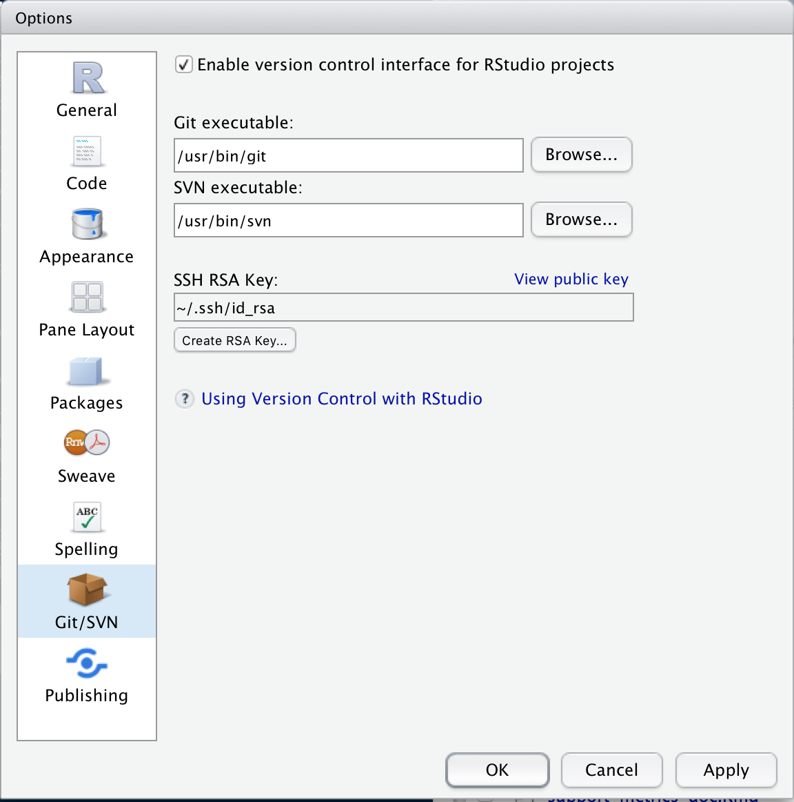
```

### Criando um novo projeto com GIT habilitado  

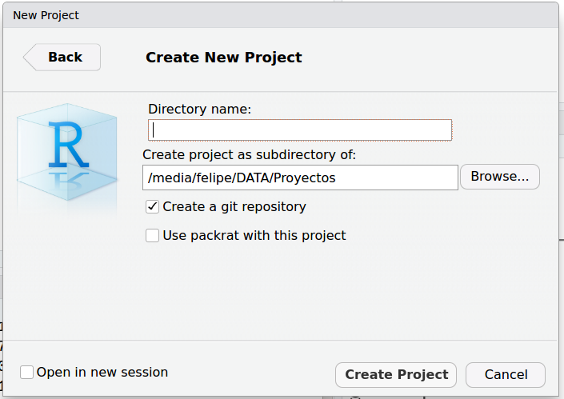
  
Para exemplificar as funcionalidades, vamos criar um script e nele:
- Vamos carregar o conjunto de dados `mtcars`;
- Faça um gráfico qualquer;  
- Salve o script;  

### Versionando (GIT commit)  

Agora que já temos um pedaço de código *funcional* do nosso script/projeto, vamos salvar uma primeira versão dele com GIT. Para isso:  
  
1. Vamos na opção "commit" presente no *menu* "GIT";
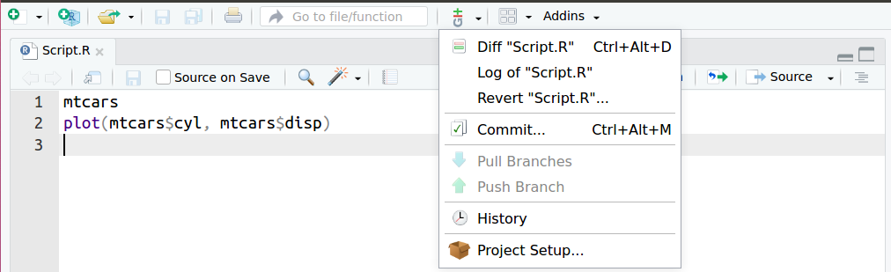


Ja janela que se abre, poderemos identificar o script que começamos a desenvolver.  
`r emo::ji("question")` Os arquivos marcados com interrogação sçao arquivos que não estão sendo versionados pelo GIT. Inicialmente nengum arquivo está sendo versionado. Precisamos informar ao sistema, qual(is) arquivo(s) será(ão) versionados;  
Por agora, vamos versionar apenas o script criado anteriormente. Para isso vamos necessitar marcar a caixa na coluna "taged", referente ao arquivo a ser versionado. Ao fazê-lo, o arquivo passará a ser marcado com um ícone "A" (de 'added'). O qeu fizemos até agora foi sinalizar ao GIT qual(is) arquivo(s) vamos versionar. Esse ato é chamado de adicionar o arquivo ao "staging area". Contudo, ainda não terminamos.

  

Perceba na figura abaixo, a área em verde. Nela estão os comando adicionados (por isso estão em verde). Quando estivemos criando uma versão em um script onde houve alguma esclusão de código, a linha onde houve exclusão estará sinalizada em vermelho.  

O que faremos agora é de fato criar uma versão, como se fosse marcando um momento do desenvolvimento do projeto (nesse caso, do script). A esse "momento" vamos escrever uma mensagem na área "commit message". Esse passo é conceitualmente chamado de "commit".  

Agora é só executar o "commit" (clciar no botão).  
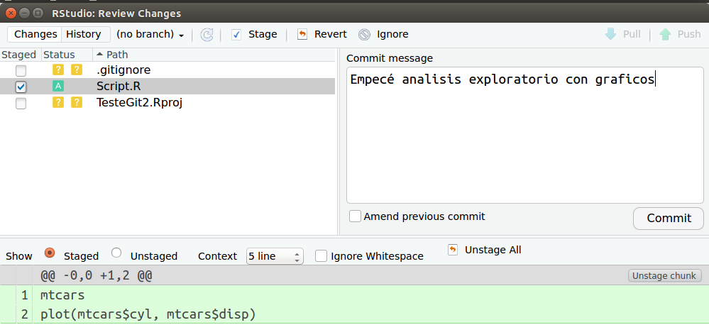

Para exemplificar as mudanças entre versões, vamos seguir trabalhando neste script. Mas agora, vamos mudar o grafico. Adicione qualquer outra coisa ou elemento que ache interessante, e vamos voltar à janela de *commit*;  

Como comentado anteriormente, a linha com o código modificado foi marcado em vermelho e a modificação acrescentada, em verde. Isso estará nó histórico do nosso projeto. Veja que podemos saber exatamente qual(is) linha(s) foi(ram) modificadas. É importante notar que sempre estaremos comparando o código atual com a ultima versão criada ("commitada"). E justamente por termos esse histórico de versões podemos voltar a um ponto anterior de nosso desenvolvimento de forma facilitada, sempre que necessário.  
Bom, sigamos versionando. Temos que colcoar nosso arquivo na *staging* área, criar a msg de *commit* e "comitá-la", para gerar uma versão do atual estado de nosso projeto;  

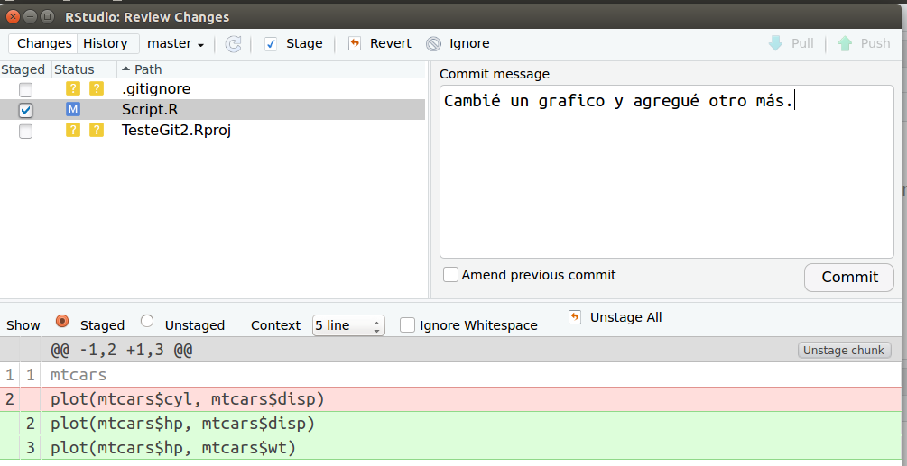

#### GIT history  
No menu *GIT*, temos uma opção chamada *history*. Adivinhem?!?! Ao acessar essa opção podemos ver todo o histórico de versões criadas, as menssagens, o autor, a data e o *SHA*. O *SHA* como se fosse um *ID* da versão. Uma forma computacional mais interessante de acessar o histórico por permitir identificar se o arquivo foi corrompido.

Mas veja que bacana: Se clicarmos em uma das versões que temos, podemos ver as alterações feitas... podemos filtrar também para buscar alguma versão em específico. Enfim, várias ferramentas que nos vai facilitar a vida como desenvolvedores.  
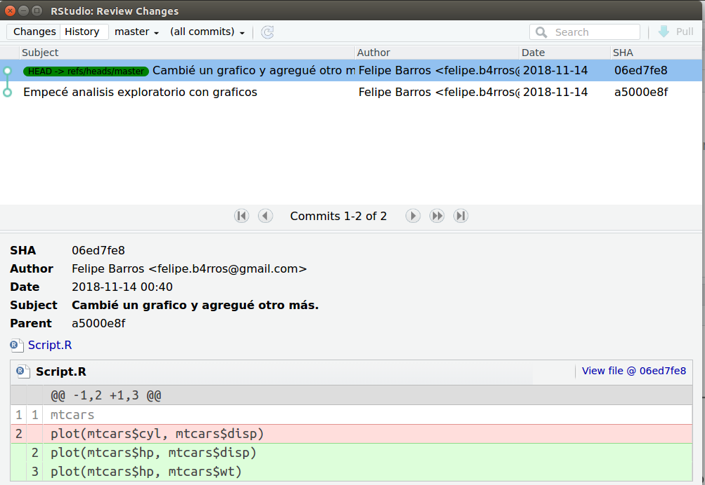  

#### GIT log
Além do histórico, temos o *log*, que é bem similar.
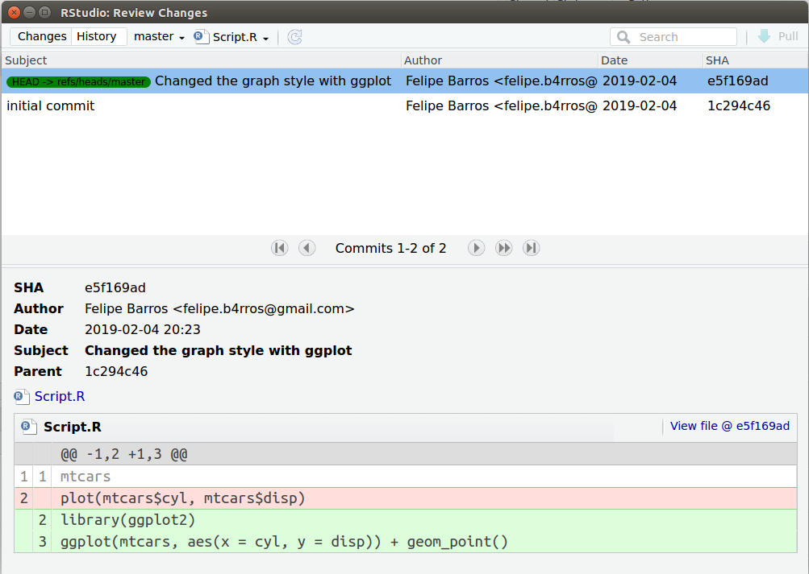  

### Branches
Até aqui tuo bem, né? Agora vou comentar um conceito bem interessante do GIT: a possibilidade de criar *branches* de nossos projetos. A tradução literal de *branches* é *rama*, como as das árvores, que derivam de um troco principal... Já conseguiu imaginar para que serve?

A ideia é comprometermos o mínio possível ao nosso projeto estável (por um projeto estável entendo que todos os scripts estão funcionando, por mais que aidna não tenham todas as suas funcionalidades desenvolvidas...).  
Então, vamos dizer que temos um projeto bem simples: um script que carrega um dado e faz um gráfica de dispersão.  
Começando do começo :), ciramos o script, e fazemos a funcionalidade solicitadas: ele carrega um arquivo de dado e gera um gráfico de dispersão. Criarmos a primeira versão, que até o momento é a versão estável, já que está executando tudo o que se supoe que ele faça.

Vamos dizer que nos solicitam que o gráfico de dispersão seja colorido segundo alguma categoría presente nos dados. Para não comprometer o script estável, podemos criar um *branch* (ou uma rama), na qual vamos adicionar o que nos foi solicitado: colorir o gráfico segundo as categorias. Uma vez feito isso, vamso testá-lo para ver se ele segue cumprindo com as funcionalidade anteriores e as funcionalidade adicionadas. U ma vez confirmada a qualidade da alteração, podemos juntar a rama criada ao "tronco principal" de nosso projeto. Dessa forma, podemosir criando as funcionalidades se ter receio de comprometer o código estável. E, claro, como tudo no processo de versionameto, podemos voltar ao ponto anterior (ou ao tronco principal) sempre que necessário.  
Para facilitar, veja a figura abaixo:  
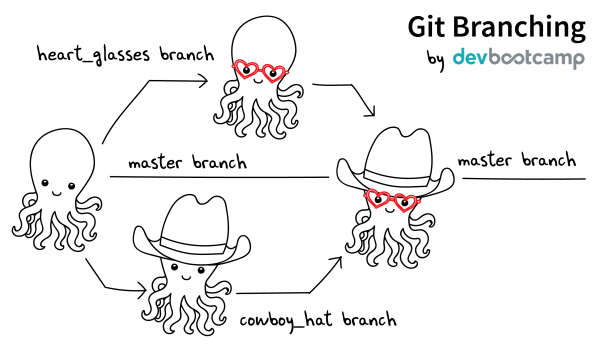  
## GitHub  

Bem, todo esse temmpo estivemos trabalhando e criando versões em nossos computadores.  
  
`r emo::ji("skull")` Mas algo pode alcontecer, não?! `r emo::ji("skull")`, nosso computador quebrar, ou precisarmos modificar alguma coisa, quando estamos sem nosso PC ou, basta termos interesse que outras pessoas colaborem em nosso projeto.  
Antes que você pense em criar seu projeto versionado em GIT numa pasta de aplicativo de núvel (*googleDrive*, por exemplo) comento que há ferramentas melhorar e mais apropriada para isso:  [GitHub](github.com)  
Vamos, então criar um **repositorio** no [GitHub](github.com).  
`r emo::ji("warning")` Pode ser *GitLab*, *BitBucket*, ou qualquer outro...  

A este repositório serão enviados tudo o que estivemos versionando, o que permitirá que outros profissionais colaborem em nossos projetos ou até mesmo, em caso de incêndio, seu projeto estará são e salvo.  
  

### GitHub New repository
Vamos criar um novo repositório:  
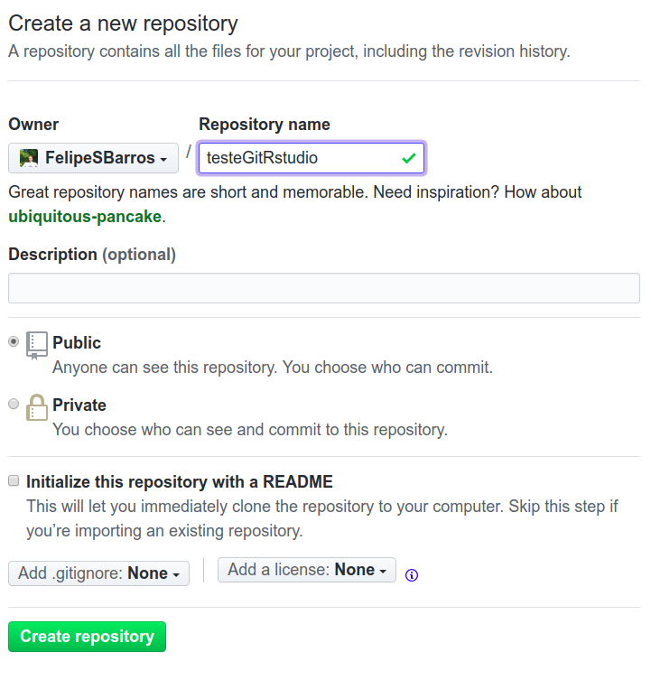  

### RStudio project/Github  

E, já qe vamos trabalhar com um repositório *virtual*, vamos cirar um novo projeto que, além do versionamento com *GIT*, vai estar *linkado* a tal repositório.
  
Para isso vamos usar a opção *Version Control*:  
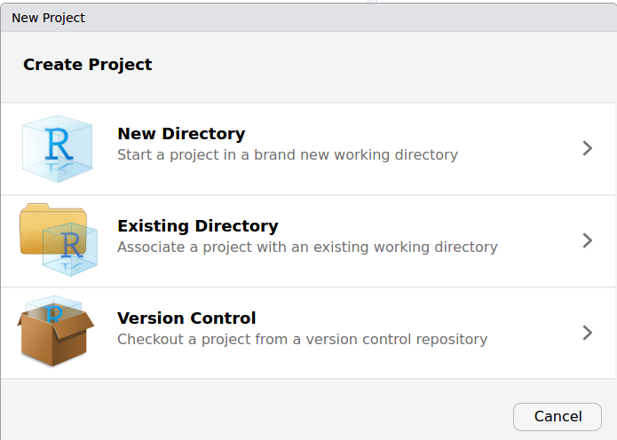  
Na janela a seguir, selecionamos a opção GIT. (OBS: SVN é outro sistema de versionamento. Não sei muito a respeito, mas o que ouvi dizer é que se trata de um sistema antigo e muito mias "pesado" que o GIT. Por isso, do sucesso desse ultimo, atualmente).  
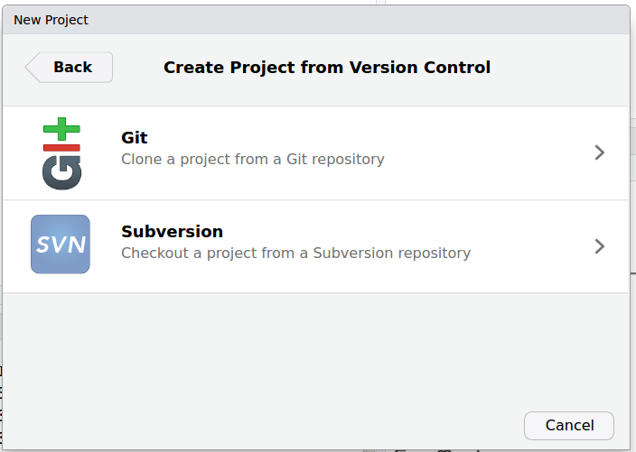  

Em seguida temos que adicionar a **url** do repositório criado anteriormente.  

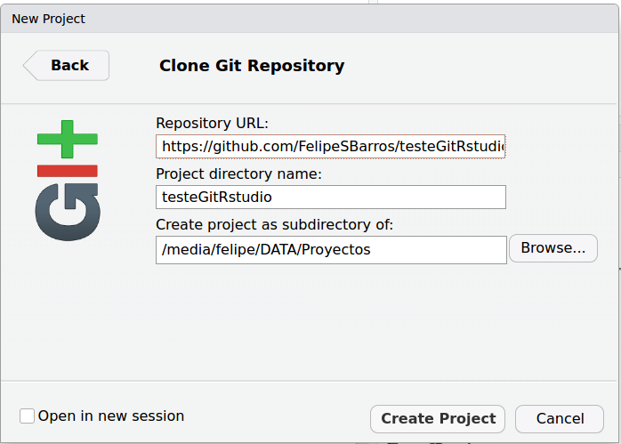  

Veja como muda as opoes do menu *GIT*.  
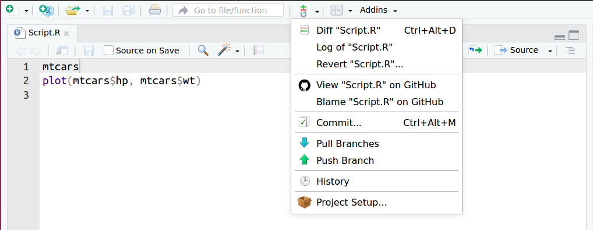  

Contudo, o que muda de fato é a possibiidade de fazer o *pull* ou o *push* das modificações ao repositório, claro, após todos os passos de adicioná-lo ao *stagin* área e comitá-lo.  

Como bem nos indica as setas em cada uma dessas funçoes:  
  
1. *Pull Branch*: serve para atualizarmos nosso repositório *local*, caso o repositório externo esteja mais atualizado;  
1. *Push Branch*: serve para, após criarmos as versões, enviá-las ao repositório externo;  

Agora o que precisa ser pensado é, quando seria o momento de enviar as modificações ao repositório externo? Não há uma definição quanto a isso. Podemos trabalhar em nosso repositório local, fazendo quantos modificações e "commits" quisermos que, quando enviarmos ao repositório externo, todos os commits serão enviados juntos. Dessa forma sempre teremos o histórico do que foi feito e não precisamos envia as versão sempre após cria-las. Passa a ser uma questão de bom-senso ou do que a equipe de desenvolvimento achar melhor.  
  

Após realizar o *Push*, nosso repositório **GitHub** deverá constar, como na figura:
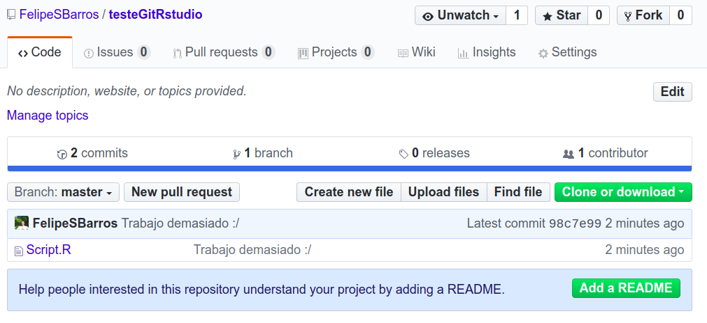
Como comentado anteriormente, esse repositório foi criado para trabalhar com versionamento com o sistema *GIT* e por isso nos oferece todas as funcionalidades existentes, como *histórico*, *log*, etc. Alpem de garantir que nossos arquivos não ficarão corrompidos, o que acostuma acontecer com sistemas de núvem...  
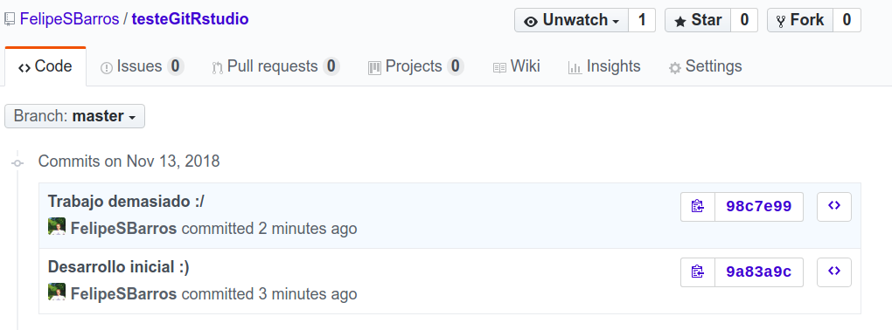  
  
Resumo
========================================================
### `r emo::ji("warning")` Versionamento/controle de versão não é para backup de arquivos!  
### `r emo::ji("book")` Livro: [**GIT Pro**](https://git-scm.com/book/en/v2)  
### `r emo::ji("book")` Outro livro: [**Happy Git and GitHub for the useR**](http://happygitwithr.com/)  
### `r emo::ji("sos")` [Mais informações](https://support.rstudio.com/hc/en-us/articles/200532077?version=1.1.442&mode=desktop)
### `r emo::ji("sos")` [Ajuda na configuração - BootCamp](https://help.github.com/articles/set-up-git/)