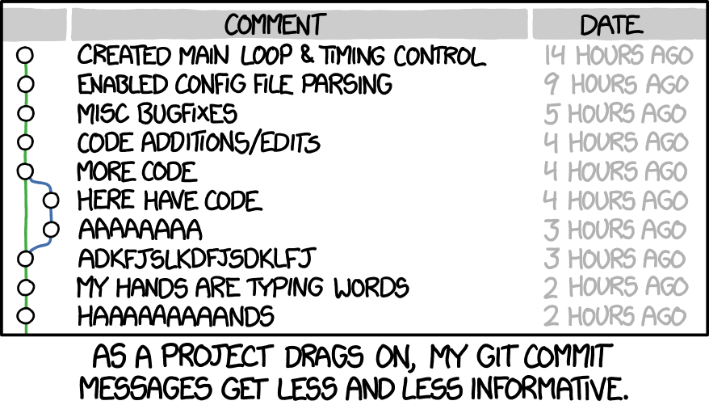
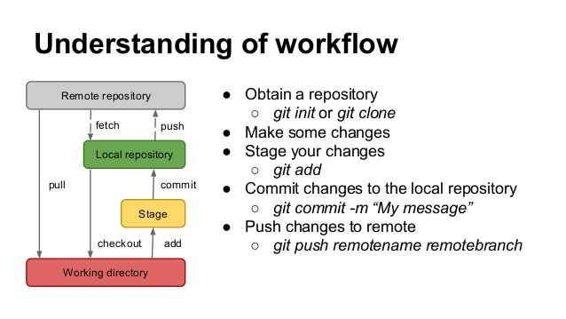

{ width=70% }  

See \autoref{phdcomic} section
\ref{intro}  

\newpage
# Versionamento com GIT e GitHub  {#intro}  

Controle de versão (ou, versionamento) é uma forma de registrar as alterações realizadas (e a evolução) de pedaços de código/scripts/software ao longo do tempo. É comum usarmos algumas estratégias para essa mesma finalidade, como por exemplo:
  
* Nomear o script que desenvolvendo com a data da ultima alteração e o autor responsável:  
>**Tese01_06_FB.R**  
>**Tese02_07_FB.R**  
>**Tese01_08_Orientador_FB.R**  
>**Tese_FINAL_FB.R**  
>**Tese_FINAL_FINALLLLLL_FB.R** 
  
Porém, há sempre a necessidade de versionarmos um mesmo documento de forma sincronizada com outros colaboradores. Geralmente acreditamos que basta compartilhar os dados/documentos em uma pasta em algum sistema de *nuvem* (*oneDrive*, *GoogleDrive*, *Dropbox*, etc), além de comentar a tais colaboradores que deverão seguir a regra anterior de nomeação dos scripts.  

Pode ser que tais estratégias sejam úteis e suficiente para alguns trabalhos. Mas há, hoje em dia, sistemas mais interessantes para fazer o mesmo de forma robusta e até certo ponto, bem mais fácil, com a ajuda do **RStudio**.  

Para o controle de versões de scripts, vamos usar o **GIT**; E para podedrmos trabalhar com outros colaboradores, vamos suar o **GitHub** (mas outros sistemas similares podem ser usados, como: *Gitlab* ou *Bitbucket*). Vamos falar sobre eles mais para frente.  

## Benefícios  

O controle de versão de seus scripts, códigos, funções e etc são importantes quando:  
  
- Vocês perceba que seu código não está produzindo o resultado após alguma modificação e vocês necessite retorná-lo ao um determinado ponto anterior;  
- Você, mesmo que sem querer, tiver excluido algum pedaço do seu código e o necessita mas já não sabe como fazê-lo novamente;  
- Quando você deseja mostrar o que foi feito, ou quer ver o que outro(s) colaborador(es) fez (fizeram);  
- Você quiser testar alguma modificação no código sem comprometer sua integridade; Ou quando você não tiver certeza que o que você pretende fazer vai funcionar;  

## *Git*: do que se trata?  
  
{ width=20% }    

*Git* é um sistema de versionamente criado por [Linus Torvald]() para permitir e facilitar a colaboração no desenvolvimento do [Linux](https://pt.wikipedia.org/wiki/Linux) de forma [assíncrona](https://pt.wikipedia.org/wiki/Comunica%C3%A7%C3%A3o_ass%C3%ADncrona);  
A ideia é que os colaboradores de um projeto possam criar modificações e fazer testes sem comprometer a versão *estavel* do script/função/software.  
  
### *Git*: Instalação e configuração  
  
1. [Download](https://git-scm.com/downloads)
1. Configuração:
    * Nome de usuário;
    * E-mail;  

```{bash, eval=FALSE}
# No terminal do GIT:
git config --global user.name "Mona Lisa"
git config --global user.name

git config --global user.email "email@example.com"
git config --global user.email
```
  
### Configurando RStudio
O *GIT* é um sistema idenpendente do *RStudio*. Ele pode ser usado através de um terminal, ou até de uma interface gráfica bem básica, chamado *GitGUI*; Contudo, já é comum que as *IDEs* (*Itegrated Development Environment*), como *RStudio*, incorporem as funcionalidades do *GIT* para permitir que façamos nosso trabalho e o controle de versão em um mesmo ambiente. 

Para usar o *Git* no *RStudio* teremos que confirgurar-lo (\autoref{Global1}) :  
  
1. Buscar no menu *tools*>*Global Options*;  
1. Clicar em *Git/SVN*;  
1. Clicar em "*Enable version control interface for RStudio projects*";  
  
* `r #emo::ji("warning")` Para usar o GIT no RStudio, é necessário sempre trabalhar com os projetos do RStudio;  
* `r #emo::ji("bulb")` Isso te obriga a trabalhar sempre com pastas específicas para cada projeto;  
* `r #emo::ji("award")` Tenha sempre em mente: **se versiona o projeto. Por isso, não misture pastas!!** `r #emo::ji("skull")`  

{ width=50% }  

### Criando um novo projeto com *Git* habilitado  

Ao criar um novo projeto, escolha a primeira opção (\autoref{ProjGIT1}) "*New Directory*", e habilite a opção "*Create a git repository*" (\autoref{ProjGIT2})  

{ width=50% }  

{ width=50% }  
  
Agora que temos um projeto de *RStudio* com o *Git* habilitado, vamos criar um script para, a partir dele explorar as funcionalidades do *Git*.
Por isso, no script criado:  
- Vamos carregar o conjunto de dados `mtcars`;  
- Criar um gráfico qualquer;  
- Salvar o script;  

### Versionando (GIT commit)  

Agora que já temos um pedaço de código *funcional* do nosso script/projeto, vamos salvar uma primeira versão dele com *Git*:  
  
1. Vamos na opção "*commit*" presente no *menu* *Git* (\autoref{MenuGit});  

{ width=50% }  
  
Na janela que se abre ( \autoref{JanelaCommit} ), poderemos identificar, dentre outros elementos, o script que começamos a desenvolver com um ícone associado:  
  
* `r #emo::ji("question")` Os arquivos marcados com **interrogação** são arquivos que não estão sendo versionados pelo *Git*. 
* `r #emo::ji("a")` Os arquivos marcados com a letra "**A**" (de "*added*") foram adicionadas ao versionamento, também chamado de *stagin area*.  

Inicialmente nenhum arquivo estará sendo versionado. Precisamos informar ao sistema, qual(is) arquivo(s) será(ão) versionados.

{ width=60% }  

Por agora, vamos versionar apenas o script criado anteriormente. Para isso vamos necessitar marcar a caixa na coluna "*Staged*", referente ao arquivo a ser versionado. Perceba que, ao fazê-lo, o arquivo passará a ser marcado com o ícone "**A**" mencionado anteriormente.  

**O que fizemos até agora foi sinalizar ao Git qual(is) arquivo(s) vamos versionar. Esse ato é chamado de adicionar o arquivo ao "staging area". Contudo, ainda não terminamos, falta fazer o "commit"** para criar a versão em nosso repositório **local**. Veja o fluxo de trabalho simplificado no \autoref{GitFlow1}.  
  
{ width=50% }  
  
Perceba na \autoref{JanelaCommit}, a área em verde. Nela estão os comando adicionados (por isso estão em verde). Quando estivemos criando uma versão em um script onde houve alguma esclusão de código, a linha onde houve tal exclusão estará sinalizada em vermelho.  

O que faremos agora é de fato criar uma versão, como se fosse marcando um momento do desenvolvimento do projeto (nesse caso, do script). A esse "momento" vamos escrever uma mensagem na área "*commit message*". Esse passo é conceitualmente chamado de "*commit*". Tendo feito isso, basta executar o "*commit*" (clicar no botão).  

* `r #emo::ji("warning")`  A ideia da menssagem de commit é ter um resumo do que foi feito para facilitar buscas no histórico de modificações/versões/momentos do código. Por padrão, no primeiro commit se usa como menssagem "*initial commit*", já que se trata de um "pota-pé inicial" e o mais importante é o que virá a partir desse primeiro *commit*.  
* Ainda com relação à mensagem, como mencionado anteriormente, não há uma regra, mas vale a pena combinar como será feito, caso vc esteja trabalhando com outras pessoas. Em geral se usa até 50 caracteres; Há alguns que gostam de usar emojis `r #emo::ji("smile")`, outros não. De qq forma, se trata de definir uma convenção e segui-la. Caso ache pertinente, há vários artigos sobre como escrever boas menssagens de commit:  [aqui](https://medium.com/compass-true-north/writing-good-commit-messages-fc33af9d6321) ou [aqui](https://www.conventionalcommits.org/en/v1.0.0-beta.2/). Evite o que é apresentado na charge ( \autoref{msgCommit} ):  

{ width=50% }  
  
Para exemplificar as mudanças entre versões, vamos seguir trabalhando neste script. Mas agora, vamos mudar o gráfico. Adicione qualquer outra coisa ou elemento que ache interessante. Salve o script e vamos voltar à janela de *commit* (Passos em \autoref{MenuGit} e depois \autoref{JanelaCommit});  

A linha do *script* que tenha sido modificada deverá estar marcada em vermelho e a modificação acrescentada, em verde, como na \autoref{msgCommit}. Isso estará nó histórico do nosso projeto. **Veja que podemos saber exatamente qual(is) linha(s) foi(ram) modificadas e que modificação(ões) foi(ram) feita(s).** E justamente por termos esse histórico de versões podemos voltar a um ponto anterior de nosso desenvolvimento de forma facilitada, sempre que necessário. É importante notar que sempre estaremos comparando o código atual com a ultima versão salva.  

Bom, sigamos versionando. Temos que colocar nosso arquivo na *staging* área, criar a msg de *commit* e "comitá-la", para gerar uma versão do atual estado de nosso projeto (neste caso, *script*);  

{ width=50% }  

* `r #emo::ji("bulb")` Um ponto a ser considerado quando começarem a usar bastante o *Git* é: **quando fazer os commits?**  

Como na maioria das coisas, não há uma definição. Mas sugere-se que sempre se faça quando houver alguma alteração significativa. Seja em correção de *bug*, criação de novas *funções*, etc. Na dúvida, pense em manter o equilíbrio: Não "commitar" a cada alteração qualquer e nem fazer grandes alteração sem commits intermediarios...  

Agora que jatemos duas versões do nosso script, vamos explorar algumas funcionalidades interessantes do *Git*.  

#### GIT history  

No menu *Git*, temos uma opção chamada *history*. Adivinhem?!?! Ao acessar essa opção podemos ver todo o histórico de versões criadas, as menssagens, o autor (sim, caso alguém faça alguma cagada, saberemos quem foi! :D), a data e o *SHA*. O *SHA* como se fosse um *ID* da versão. Uma forma computacional mais interessante de acessar o histórico por permitir identificar se o arquivo foi corrompido.  

Mas veja que bacana: Se clicarmos em uma das versões que temos, podemos ver as alterações feitas... podemos filtrar também para buscar alguma versão em específico ( \autoref{label} ). Enfim, várias ferramentas que nos vai facilitar a vida como desenvolvedores.  
{ width=50% }  

#### GIT log  

Além do histórico, temos o *log*, que é bem similar ( \autoref{log1} ).  

{ width=50% }  

### Branches  

Até aqui tudo bem, né? Agora vou comentar um conceito bem interessante do *Git*, **mas que não vou explorar por agora**: a possibilidade de criar *branches* de nossos projetos. A tradução literal de *branches* é *rama*... como as das árvores, que derivam de um troco principal... Já conseguiu imaginar para que serve?  

A ideia é comprometermos o mínio possível ao nosso projeto estável (por um projeto estável entendo quando temos scripts/funções/etc funcionando como desejado, por mais que ainda não tenham todas as suas funcionalidades desenvolvidas...).  

Então, vamos dizer que temos um projeto bem simples: um script que carrega um dado e faz um gráfico de dispersão.  

Começando do começo :), ciramos o script, e fazemos a funcionalidade solicitadas: ele carrega um arquivo de dado e gera um gráfico de dispersão. Criarmos a primeira versão, que até o momento é a versão estável, já que está executando tudo o que se supõe que ele faça.

Vamos dizer que nos solicitam que o gráfico de dispersão seja colorido segundo alguma categoria presente nos dados. Para não comprometer o script estável qu temos no momento, podemos criar um *branch* (ou uma rama), na qual vamos adicionar o que nos foi solicitado: colorir o gráfico segundo as categorias. Uma vez feito isso, vamos testá-lo para ver se ele segue cumprindo com as funcionalidade anteriores e as funcionalidades adicionadas. Uma vez confirmada a qualidade da alteração, podemos juntar a rama criada ao "tronco principal" de nosso projeto (*merge*). Dessa forma, podemos ir criando as funcionalidades sem o receio de comprometer o código estável. E, claro, como tudo no processo de versionameto, podemos voltar ao ponto anterior (ou ao tronco principal) sempre que necessário.  

Para facilitar, veja a \autoref{octopus}:  

{ width=60% }  

## GitHub  

Bem, todo esse temmpo estivemos trabalhando e criando versões em nossos computadores (**Git local repository**).  
  
* `r #emo::ji("skull")` Mas algo pode alcontecer, não?! `r #emo::ji("skull")`, nosso computador pode quebrar, ou precisarmos modificar alguma coisa quando estamos viajando sem o nosso PC ou, basta termos interesse que outras pessoas colaborem em nosso projeto.  

Antes que você pense em criar seu projeto versionado em GIT numa pasta de aplicativo de nuvem (*googleDrive*, por exemplo) comento que há ferramentas melhores e mais apropriada para isso: [GitHub](github.com)  

Vamos, então criar um *login* e posteriormente um **repositorio** no [GitHub](github.com).  

> `r #emo::ji("warning")` Pode ser *GitLab*, *BitBucket*, ou qualquer outro...  

A este repositório serão enviados tudo o que estivermos versionando, o que permitirá que outros profissionais colaborem em nossos projetos ou até mesmo, em caso de incêndio, seu projeto estará são e salvo.  

{ width=50% }  

### GitHub New repository  

Vamos criar um novo repositório ( \autoref{newRepo} ):  

{ width=50% }  

### RStudio project/Github  

E, já qe vamos trabalhar com um repositório *remoto/virtual*, precisaremos criar um novo projeto que, além do versionamento com *Git*, vai estar *linkado* a tal repositório *remoto* do *GitHub*.  
  
Para isso vamos usar a opção *Version Control* ( \autoref{VersionCtrl} ):  

{ width=50% }  

A seguir, selecionamos a opção GIT ( \autoref{JanelaGitSVN} ).  

> **OBS:** *SVN* é outro sistema de versionamento. Não sei muito a respeito, mas o que ouvi dizer é que se trata de um sistema antigo e muito mais "pesado" que o Git.  

{ width=50% }  

Em seguida ( \autoref{JanelaURL} ) temos que adicionar a **url** do repositório criado anteriormente.  

{ width=50% }  

Veja ( \autoref{OpcoesGit} ) como muda as opoes do menu *GIT*.  

{ width=50% }  

O que muda, na verdade, é a possibiidade de fazer o *Pull Branches* ou o *Push Branches* das modificações ao repositório. Claro, isso após todos os passos de adicioná-lo ao *stagin* área e realizar o *commit*.  

Como bem nos indica as setas em cada uma dessas funçoes:  
  
1. *Pull Branches*: serve para atualizarmos nosso repositório **local**, caso o repositório **remoto** esteja mais atualizado;  
1. *Push Branches*: serve para, após criarmos novas versões (atualizarmos nosso reporitório **local**), enviá-las ao repositório **remoto**;  

Além de pensar e discutir a melhor forma de escrever as mensagens de commit, vale refletir sobre **quando seria o momento de enviar as modificações ao repositório externo?**  

Não há uma definição quanto a isso. Podemos trabalhar em nosso repositório local, fazendo quantas modificações e *commits* quisermos que, quando enviarmos ao repositório externo, todos os *commits* serão enviados juntos. Dessa forma sempre teremos o histórico do que foi feito e não precisamos envia as versão sempre após cria-las. Passa a ser uma questão de bom-senso ou do que a equipe de desenvolvimento achar melhor.  

Após realizar o *Push* ao repositório remoto do *GitHub*, o mesmo deverá constar, como na \autoref{commitGitHub1} e \autoref{commitGitHub2}, os *commits* realizados.  

{ width=50% }  

{ width=50% }  

Lembram-se do *workflow* do git mostrado anteriormente ( \autoref{GitFlow1} )? Então, com ao considerarmos o uso do *GitHub*, temos um *workflow* assim ( \autoref{GitFlow2} ):

{ width=50% }  

Como comentado anteriormente, esse repositório foi criado para trabalhar com versionamento com o sistema *Git* e por isso nos oferece todas as funcionalidades existentes, como *histórico*, *log*, etc. Isso tuo além de garantir que nossos arquivos não ficarão corrompidos, o que acostuma acontecer com sistemas de nuvem...  

Levem em consideração que o *GitHub* é um sistema criado para versionamento de *software*. Por isso ele possui vários elementos que não foram comentados aqui, como por exemplo:  
  
* A possibilidade de definir *bugs*, *issues*, etc;
* Criar *milestone* par facilitar acompanhamento dos projetos;  
  
## Resumo  

* `r #emo::ji("warning")` Versionamento/controle de versão não é para backup de arquivos!  
* `r #emo::ji("book")` Livro: [**GIT Pro**](https://git-scm.com/book/en/v2)  
*  `r #emo::ji("book")` Outro livro: [**Happy Git and GitHub for the useR**](http://happygitwithr.com/)  
* `r #emo::ji("sos")` [Mais informações](https://support.rstudio.com/hc/en-us/articles/200532077?version=1.1.442&mode=desktop)  
* `r #emo::ji("sos")` [Ajuda na configuração - BootCamp](https://help.github.com/articles/set-up-git/)  
* https://sebastiansauer.github.io/writing_tools/  